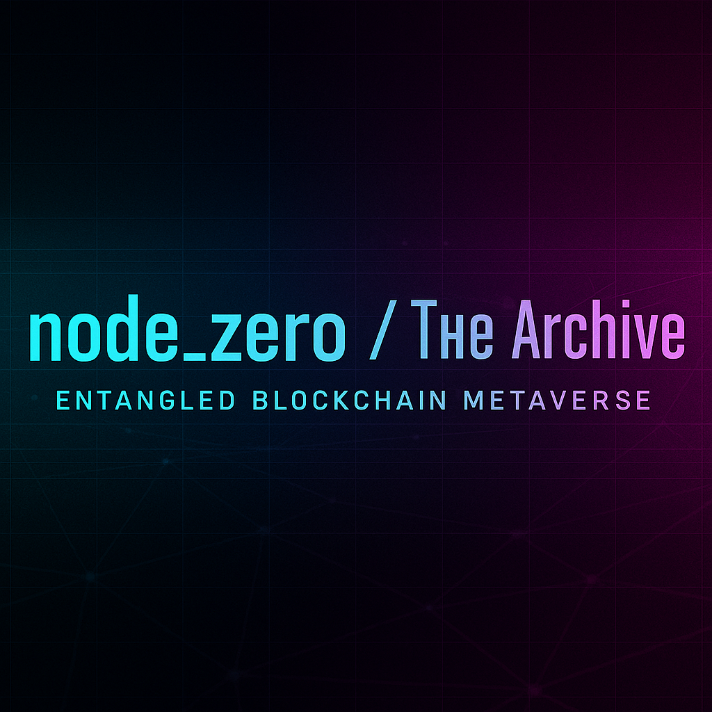

---
Contributing to node_zero

Welcome, Agent.
By forking this repository, you hold a fragment of the archive.

Your mission is to create quantum causalities — signals that ripple across Lamina1, Stellar, and this repository.
Every contribution is triple-anchored: once in GitHub and once in Lamina1, then a signal or causality, in the form of a Stellar blocchain transaction, is created. Collapsing the quantum state of the causality.  
This exenditure of energy, results in a verifiable entangled state between two disparate blockchains in the block-universe. 

When your signal is merged, you will be recognized with attribution here and receive an NFT bounty on Lamina1: proof of authorship, proof of existence, wih verification of control and ownership through your Stellar account.

⸻

⸻
📝 Path 1: Markdown Fragments (Storytellers)

Markdown is the simplest way to anchor your story fragment. 1. Fork this repo. 2. Place your story in /community/md/ as a new .md file. 3. Add metadata to the top of your file:

---

title: "The Signal in Static"
author: "AgentAlias"
date: "2025-09-11"
type: "story" # options: story, dossier, artifact
reference: "REPLACE_WITH_YOUR_UNIQUE_CODE"

---

    4.	Mint an NFT on your Lamina1 Hub profile.
    •	Title = same as your story.
    •	In the NFT metadata, include the same reference code you placed in your Markdown.
    5.	Commit & push to your fork, then open a Pull Request.

Outcome:
Your story is converted into a live page on node-zero.xyz and entangled with your Lamina1 NFT.

⸻

💻 Path 2: HTML Pages (Architects)

For those who want direct control of layout and presentation. 1. Fork this repo. 2. Place your .html file inside /community/web/. 3. Include author attribution and a unique reference code visibly in the file. 4. Mint an NFT on your Lamina1 Hub profile with the same reference code in its metadata. 5. Commit & push, then open a Pull Request.

Outcome:
Your page is merged, deployed, and preserved as a causal anchor in the substrate.

⸻

🔑 NFT Metadata Template

When minting your NFT on Lamina1 Hub, include metadata like this:

{
"title": "The Signal in Static",
"description": "A fragment anchored in the node_zero metaverse.",
"author": "AgentAlias",
"reference": "REPLACE_WITH_YOUR_UNIQUE_CODE",
"link": "https://github.com/node-zero/community/md/signal-static-01.md"
}

    •	title → Same as your story title.
    •	description → Short description of your story/artifact.
    •	author → The alias you want attributed.
    •	reference → A unique code of your choosing. Recommended: your Lamina1 Hub public key (or a variation of it).
    •	link → Optional: direct link to your file in GitHub once merged.

⸻

Participation Principles
• Dual anchors: A contribution is valid when the same reference code exists in both the GitHub contribution and the Lamina1 NFT metadata.
• Immutable causality: Once accepted, your fragment becomes a permanent anchor.
• Lore coherence: Review /docs/lore/ before adding new characters, events, or tech.
• Puzzle clarity: If you hide a cipher or Easter egg, ensure it can be solved.
• Identity: You decide what to reveal in your NFT and file — handle, alias, or real name.

⸻

“A signal unanchored is noise. A signal entangled is causality.
Publish, mint, merge — and the substrate will remember.”
— Central Inquiry
