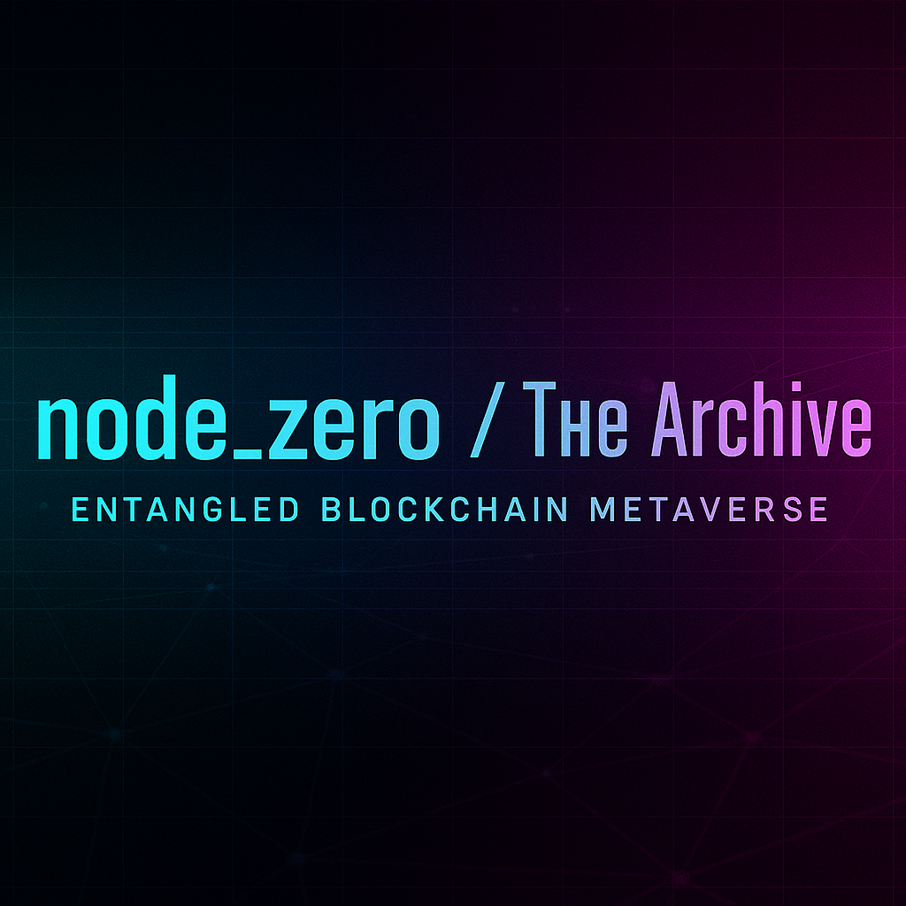

---
# node_zero // The Archive

**The signal you were not meant to hear.**  
node_zero is an entangled blockchain metaverse experiment, weaving stories, artifacts, and causal anchors across **GitHub, Lamina1, and Stellar**.

This repository is the **meta-archive**:

- Stories and dossiers are preserved here.
- Contributions from agents become fragments of the substrate.
- Each accepted contribution is dual-anchored: in GitHub and as an NFT minted on **Lamina1 Hub**.

When you fork this repo, you are not cloning code.  
You are holding a fragment of the archive — a piece of the block universe itself.

---

## Mission

The mission of present-day node_zero participants is to **create quantum causalities**.  
Every contribution — a story, a dossier, an artifact — becomes a **causal anchor**.

Anchors are entangled through:

- **GitHub commits** (the public archive)
- **Lamina1 NFTs** (the quantum anchor)
- **Stellar transactions** (the activation signal)

Together, these three anchors form coherence across timelines, echoing through the block universe.

---

## How to Participate

There are two ways to contribute fragments:

- **Markdown Fragments (Storytellers):**  
  Write in Markdown. Your contribution is converted into a published page.

- **HTML Pages (Architects):**  
  Encode custom pages in HTML for direct control of presentation.

In both cases, you must also **mint a Lamina1 NFT** to represent your story.  
Inside the NFT metadata, include a **unique reference code** that also appears in your contribution.  
This dual presence is what entangles the archive.

👉 See [CONTRIBUTING.md](./CONTRIBUTING.md) for detailed steps.

---

## Rewards

- **Attribution** → Your chosen name or alias inscribed in the archive.
- **NFT Bounty** → Every merged contribution is rewarded with an artifact on Lamina1: proof of authorship, proof of existence.

---

## Archive Structure

- `/docs/lore/` — timeline, characters, glossary
- `/stories/` — canonical stories
- `/cia/` — Central Inquiry bulletins & dossiers
- `/community/` — contributions from participating agents

---

## Public Repository

With the publication of the chapter _Betanet — Promise and Play (2023)_, the entire **node_zero** repository has been made public.  
This archive is open for reading, forking, and contribution.

You can access it here: [https://github.com/lockb0x-llc/node-zero](https://github.com/lockb0x-llc/node-zero)

Contributors are encouraged to explore the stories, lore, and artifacts — and to add their own fragments through pull requests.  
Remember: each fragment you contribute is both a story and a causal anchor, mirrored across GitHub, Lamina1, and Stellar.

---

## Principles of Participation

- **Triplet Anchors:** A contribution is valid only when mirrored in all three places: GitHub, Lamina1 NFT metadata, and a Stellar signature transaction.
- **Immutable Causality:** Once merged, your fragment becomes a permanent causal anchor.
- **Lore Coherence:** Check `/docs/lore/` before introducing new elements.
- **Puzzle Clarity:** If embedding a cipher, ensure it can be solved.
- **Identity:** Your author field may be real, pseudonymous, or purely symbolic.

---

> _“Signals entangle. Anchors persist.  
> Each fragment you add shifts the coherence of the future.  
> Welcome to the Inquiry.”_  
> — Central Inquiry
=======

---
